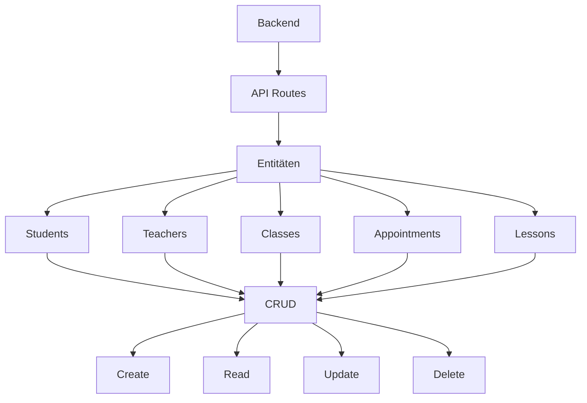
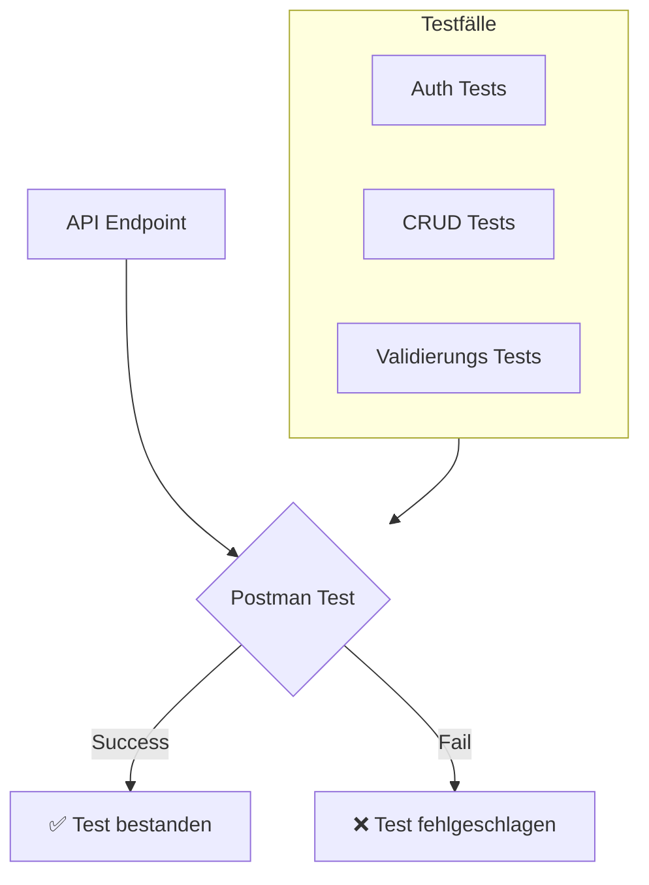

# KSH-Unterrichtsplanung
## Interdisziplinäre Projektarbeit

---
transition: view-transition
layout: 'title-content'
hideInToc: true
---

<template v-slot:title>

# Inhaltsverzeichnis
</template>

<template v-slot:content>

- Einleitung
<v-clicks animated="true">

- Aufgabenstellung und Ausgangslage
- Vorgehen und Planungsinstrumente
- Konzeption der Applikation
- Technologieauswahl
- Umsetzung
- Testing
- Demo der Applikation
- Fazit und Ausblick
</v-clicks>
</template>

---
transition: view-transition
layout: 'title-content'
---

<template v-slot:title>

# Aufgabenstellung
</template>

<template v-slot:content>

<v-clicks animated="true">

- 📅 **Kalender**
- 👩‍🏫 **Lehrkräfte**
  - Ansicht
  - Lektionen erfassen und bearbeiten
  - Hausaufgaben
  - Prüfungen
  - Notizen
- 🧑‍🎓 **Sus**
  - Kalenderansicht
- 📥 **Importieren**

</v-clicks>
</template>


---
transition: view-transition
layout: two-content
---

<template v-slot:title>

# Planungsinstrumente
</template>

<template v-slot:left>

  ## Projektmanagements-Methode
  <!--War schon in vorherigen Projekte unsere go-to PM-Methode, Alle Gruppenmitglieder sind mit der Methode vertraut. -->
  - 🤝 **Vertrautheit**
  <!--Eignet sich für eine strukturierte Arbeitsweise. Iperka hat uns gezwungen schon von Grund auf eine gut durchdachte Planung zu entwerfen, was bei einer PM-Methode wie SCRUM nicht der Fall gewesen wäre-->
  - 🗃️ **Strukturiert**
</template>

<template v-slot:right>

  ## Kollaborationssoftware / Groupware
  <logos-notion-icon class="text-3xl" />
  <!--Für die Kollaborationssoftware haben wir das Tool Notion verwendet. Grund dafür waren u.A. die vielen Funktionalitäten die es anbietet, so z.B. das automatische Erstellen von Gantt-Diagrammen, perfekt für unser IPERKA. Zudem -->
  - **Funktionen** Kalender 📅, Erinnerungen ⏰, anpassbare Vorlagen und einfache Oberfläche 🖥️.
  - 📤📥 **Teamarbeit** Perfekt für parallele Aufgaben, bei denen alle Teammitglieder gleichzeitig informiert sind .
  - 📅 **Planung & Terminierung** Zuteilung von Aufgaben und Festlegung von Terminen mit Abhängigkeiten 🔗.
  <!--Ausserdem gab es eine gewisse Transparenz, sowohl für uns, aber auch für sie als betreuer, da Ist- und Soll-Zustand jederzeit einsehbar, Planung immer abrufbar .-->
  - 👀 **Transparenz**

</template>

---
transition: view-transition
layout: two-content
---

<template v-slot:title>

# Zeitplanung
</template>

---
layout: dashboard
---

<template v-slot:title>

# Aufbau der Applikation
</template>

<div class="flex gap-16 items-center justify-center mt-20">
  <div v-click class="flex flex-col items-center">
    <div class="text-6xl mb-4 bg-blue-100 p-8 rounded-xl shadow-md">
      <mdi-monitor-screenshot />
    </div>
    <div class="text-xl opacity-80 font-semibold">View</div>
    <div class="text-sm opacity-50">Benutzeroberfläche</div>
  </div>
  <div v-click class="flex flex-col gap-8">
    <div class="text-3xl text-gray-400">
      <carbon-arrow-right />
    </div>
    <div class="text-3xl text-gray-400">
      <carbon-arrow-left />
    </div>
  </div>
  <div v-click class="flex flex-col items-center">
    <div class="text-6xl mb-4 bg-green-100 p-8 rounded-xl shadow-md">
      <mdi-xml />
    </div>
    <div class="text-xl opacity-80 font-semibold">Controller</div>
    <div class="text-sm opacity-50">Steuerungslogik</div>
  </div>
  <div v-click class="flex flex-col gap-8">
    <div class="text-3xl text-gray-400">
      <carbon-arrow-right />
    </div>
    <div class="text-3xl text-gray-400">
      <carbon-arrow-left />
    </div>
  </div>
  <div v-click class="flex flex-col items-center">
    <div class="text-6xl mb-4 bg-red-100 p-8 rounded-xl shadow-md">
      <mdi-database />
    </div>
    <div class="text-xl opacity-80 font-semibold">Model</div>
    <div class="text-sm opacity-50">Datenspeicher</div>
  </div>
</div>

---
layout: two-content
background: 
image: /public/low-fidelity.png
---
<template v-slot:title>

# Frontendskizze
</template>

<template v-slot:left>
<div class="grid grid-cols-1 grid-rows-1">
  <div class="col-start-1 row-start-1" v-click.hide="1">
    
  </div>
  <div class="col-start-1 row-start-1" v-click="1">
    
  </div>
</div>
</template>

<template v-slot:right>
<div class="grid grid-cols-1 grid-rows-1">
  <div class="col-start-1 row-start-1" v-click.hide="1">
    <h2>Designansatz</h2>
    <ul class="mt-4">
      <li>🎨 Zuerst Designs erstellt für grobe UI-Vorstellung</li>
      <!-- Wir haben uns entschieden, nicht direkt mit dem Frontend zu beginnen, sondern Design zu entwickeln. -->
      <li>📱 Low-Fidelity Keyscreens</li>
      <!-- Erste Skizzen von Hand, um die Grundstruktur zu visualisieren. -->
      <li>✏️ Mehrere Skizzen pro Key-Screen</li>
      <!-- Wir wollten uns nicht einschränken und haben mehrere Varianten erstellt. -->
      <li>🏆 Auswahl der Favoriten</li>
      <!-- Aus den Skizzen einen Favoriten gewählt, um mit einem Mid-Fidelity Wireframe weiterzuarbeiten. -->
    </ul>
  </div>

  <div class="col-start-1 row-start-1" v-click="1">
    <h2>Mid-Fidelity Wireflow</h2>
    <ul class="mt-4">
      <li>🔧 Tool: Moqups</li>
      <li>🔎 Detailiertere Keyscreens</li>
      <!-- Vorstellung des userflows -->
      <li>💬 Präsentation & Feedback</li>
      <!-- Fertigen wireflow unseren Betreuungslehrpersonen gezeigt, um wertvolles Feedback zu erhalten. -->
    </ul>
  </div>
</div>
</template>
---
layout: center
---

<div class="flex text-center">

# Technologieauswahl der verschiedenen Komponenten
</div>

---
layout: dashboard
---

<template v-slot:title>

# Backend
</template>

<table>
  <tr>
    <th>Sprache (Framework)</th>
    <th>Vorwissen</th>
    <th>Built-in Features</th>
  </tr>
  <tr>
    <td>Python (Flask)</td>
    <td>3</td>
    <td>4</td>
  </tr>
    <tr>
    <td>Python (Django)</td>
    <td>1</td>
    <td>5</td>
  </tr>
    <tr>
    <td>Javascript (Express)</td>
    <td>3</td>
    <td>4</td>
  </tr>
  <tr>
    <td>Go (Echo, Gin)</td>
    <td>1</td>
    <td>3</td>
  </tr>
  <tr>
    <td>Javascript (NextJS)</td>
    <td>5</td>
    <td>5</td>
  </tr>
</table>

<style>
  th {
    font-weight: bold;
  }
</style>

---
layout: dashboard
---

<template v-slot:title>

# Frontend
</template>


<table>
  <tr class="font-bold">
    <th>Sprache (Framework)</th>
    <th>Vorwissen</th>
    <th>Built-in Features</th>
  </tr>
  <tr>
    <td>Javascript</td>
    <td>5</td>
    <td>1</td>
  </tr>
    <tr>
    <td>React</td>
    <td>3</td>
    <td>2</td>
  </tr>
    <tr>
    <td>Astro</td>
    <td>1</td>
    <td>4</td>
  </tr>
  <tr>
    <td>Angular</td>
    <td>1</td>
    <td>2</td>
  </tr>
  <tr>
    <td>NextJS</td>
    <td>4</td>
    <td>4</td>
  </tr>
</table>

<style>
th {
  font-weight: bold
}
</style>

---
layout: two-content
---

<template v-slot:title>

# Warum NextJS als Framework
</template>

<template v-slot:left>

- 🎯 **Einheitliche Technologie**
  - JavaScript für Frontend & Backend
  - Weniger Technologie-Wechsel
<v-clicks animated="true">

- 🚀 **Serverless Ready**
  - API-Routen integriert
  - Einfaches Deployment
- 👥 **Team-Erfahrung**
  - Vorhandenes JS Know-how
  - Schnelle Implementierung

</v-clicks>
</template>

<template v-slot:right>


</template>

---
layout: two-content
---

<template v-slot:title>

# Datenbank
</template>

<template v-slot:left>
<div v-click class="flex text-[200px] w-full h-[85%] flex-col">
  <div v-click.hide="3">
    <h1>Planetscale</h1>
    <logos-planetscale />
  </div>
</div>
</template>

<template v-slot:right>
<div v-click="2" class="flex text-[200px] w-full h-[85%] flex-col">
  <h1>MongoDB</h1>
  <logos-mongodb-icon />
</div>
</template>

---
layout: dashboard
---

<template v-slot:title>

# Benutze Libraries
</template>

---
layout: title-content
---

<template v-slot:title>

# Tech Stack Ablauf
</template>

<template v-slot:content>

<div class="flex gap-12 items-center justify-center mt-28">
  <div v-click="1" class="flex flex-col items-center">
    <div class="text-6xl mb-4">
      <logos-nextjs-icon />
    </div>
    <div class="text-sm opacity-50">Next.js Frontend</div>
  </div>
  <div v-click="1" class="text-3xl text-gray-400">
    <carbon-arrow-right />
  </div>
  <div v-click="2" class="flex flex-col items-center">
    <div class="text-6xl mb-4">
      <logos-nextjs-icon />
    </div>
    <div class="text-sm opacity-50">Next.js Backend</div>
  </div>
  <div v-click="2" class="text-3xl text-gray-400">
    <carbon-arrow-right />
  </div>
  <div v-click="3" class="flex flex-col items-center">
    <div class="text-6xl mb-4">
      <logos-prisma />
    </div>
    <div class="text-sm opacity-50">Prisma</div>
  </div>
  <div v-click="3" class="text-3xl text-gray-400">
    <carbon-arrow-right />
  </div>
  <div v-click="4" class="flex flex-col items-center">
    <div class="text-6xl mb-4">
      <logos-mongodb-icon />
    </div>
    <div class="text-sm opacity-50">MongoDB</div>
  </div>
</div>
</template>


---
layout: center
background: '/cover-image.jpg'  # Du kannst hier dein eigenes Hintergrundbild verwenden
---

<h1>Frontend Umsetzung</h1>

<div class="text-xl text-gray-200 mt-4">
Moderne API-Architektur mit Next.js
</div>

<style>
h1 {
  background-color: #2B90B6;
  background-image: linear-gradient(45deg, #4EC5D4 10%, #146b8c 20%);
  background-size: 100%;
  -webkit-background-clip: text;
  -moz-background-clip: text;
  -webkit-text-fill-color: transparent;
  -moz-text-fill-color: transparent;
}
</style>

---
layout: two-content
---
<template v-slot:title>

# Erste Implementation des UIs
</template>

<template v-slot:left>

  
  ## Grundlegende Umsetzung
  - 🖥️ Start mit Grundgerüst
  <!-- Fokus auf UX-Validierung und erster visueller Eindruck, ohne die Datenverarbeitung und grosse Funktionalitäten zu beachten. -->
  - Keine ständige Anpassung für Datenverarbeitung 🛑
  <!-- Das Grundgerüst ermöglicht schnelle Tests ohne ständige Implementierungen. -->
  - Spaß an sichtbarem Fortschritt 🎉
  <!-- Es macht mehr Spaß, das Grundgerüst zuerst zu sehen und darauf aufzubauen. -->

  ## Erste Seiten
  - Landing Page als Referenz für das Design 📄
  <!-- Einfaches Design aus dem Wireframe übernommen, erste Implementierung der UI-Elemente. -->
  - Login-Seite als Mischung aus Wireframe & Landing Page 🔑
  <!-- Login-Seite basiert auf Wireframe und enthält interaktive Formulare. -->
  - Formularseite für Lektionen 🎓
  <!-- Anpassung des Designs für eine bessere Benutzererfahrung und intuitive Eingabe. -->
</template>

<template v-slot:right>

  ## UX-Verbesserungen
  - Auswahl der Lektionstypen: Verbesserung der Eingabefelder 🎯
  <!-- Die Eingabefelder wurden umstrukturiert, um intuitiv zu wirken. -->
  - Gruppierung der Felder für bessere Usability 🧩
  <!-- Felder für allgemeine Infos zusammengefasst, um den Eingabeprozess zu optimieren. -->
  - Abstand zwischen Feldern für bessere Wahrnehmung 📏
  <!-- Unterschiedliche Abstände zwischen den Eingabefeldern sorgen für visuelle Klarheit. -->

  ## Weitere Überlegungen
  - Millersche Zahl für Eingabefelder 🧠
  <!-- Einhaltung der Begrenzung von 7±2 Chunks für bessere kognitive Belastung. -->
  - Markdown für Notizen zur individuellen Anpassung ✍️
  <!-- Lehrpersonen können das UI anpassen, was das Nutzererlebnis verbessern sollte. -->
</template>


---
layout: two-content
---

<template v-slot:title>

# Implementierung des Kalenders
</template>

<template v-slot:left>

  ## Entscheidung für FullCalendar
  - Schnelle Entscheidung ohne komplexe Analyse 🔍
  <!-- Die Wahl fiel schnell auf FullCalendar ohne lange Entscheidungsprozesse. -->
  - Vorteile von FullCalendar 🏆
  <!-- Viele Optionen, gute Dokumentation, MIT-Lizenz und kostenlos in der Basisversion. -->
  - Vergleich mit anderen Bibliotheken 📊
  <!-- Andere Kalender wie DHTMLX hatten kostenpflichtige Versionen, FullCalendar nicht. -->
  - Vollständige Funktionalität in der kostenlosen Version 💸
  <!--  alle benötigten Funktionen waren in der kostenlosen Stufe verfügbar. -->
</template>

<template v-slot:right>

  ## Nutzung von FullCalendar
  - Einfache Anpassung des Kalenders 🛠️
  <!-- Vollständige Anpassbarkeit für unsere Anforderungen durch zahlreiche Optionen. -->
  - Viele Plugins & Funktionen 🔌
  <!-- Plugins erleichtern die Kalender-Integration und Anpassung an unsere Bedürfnisse. -->
  - Fokus auf Datahandling 📊
  <!-- Hauptsächlich Arbeit an der Datenverarbeitung und -darstellung. -->
  - Wechsel zwischen verschiedenen Ansichten 🔄
  <!-- Einfache Handhabung der Kalenderansicht, basierend auf den Nutzerrollen. -->
</template>


---
layout: two-content
---

<template v-slot:title>

# Überarbeitung des Designs
</template>

<template v-slot:left>

  ## Designüberarbeitung
  - Erste Version wirkte veraltet ⏳
  <!-- Das ursprüngliche Design erinnerte uns an die frühen Tage des Internets. -->
  - Boxenlayout mit Interaktionen und Chunks nicht modern genug 📦
  <!-- Das Design war in einer Box, was den modernen Anforderungen nicht gerecht wurde. -->
  - Entscheidung zur Neugestaltung ✏️
  <!-- Wir entschieden uns, das Design grundlegend zu überarbeiten. -->
  - Inspiration von KSH-Website 🌐
  <!-- Farbliche Gestaltung basierend auf der Website der KSH. -->
  - Blassere Farben für den Hintergrund 🎨
  <!-- Der Hintergrund wurde in einem blasseren Blau gewählt, um Texte und Bilder hervorzuheben. -->
  - Verbesserung der Sichtbarkeit der Eingabefelder 🔲
  <!-- Eingabefelder wurden stärker hervorgehoben, um bessere Usability zu gewährleisten. -->
  
</template>

<template v-slot:right>

</template>


---
layout: center
background: '/cover-image.jpg'  # Du kannst hier dein eigenes Hintergrundbild verwenden
---

# Backend 

<div class="text-xl text-gray-200 mt-4">
Moderne API-Architektur mit Next.js
</div>

<style>
h1 {
  background-color: #2B90B6;
  background-image: linear-gradient(45deg, #4EC5D4 10%, #146b8c 20%);
  background-size: 100%;
  -webkit-background-clip: text;
  -moz-background-clip: text;
  -webkit-text-fill-color: transparent;
  -moz-text-fill-color: transparent;
}
</style>


---
layout: two-content
---

<template v-slot:title>

# Backend Architektur
</template>

<template v-slot:left>



</template>

<template v-slot:right>

## Struktur
<v-clicks animated="true">

- 📁 **API-Routes**
  - RESTful Endpunkte
  - Modular aufgebaut
- 🔄 **CRUD Operationen**
  - Standardisierte Methoden
  - Entity-basierte Struktur
- 🛠️ **Prisma als ORM**
  - Type-safe Queries
  - MongoDB Integration

</v-clicks>

</template>

---
layout: dashboard
---

<template v-slot:title>

# API Endpunkt
</template>


```ts {all|9|11-15|17-27|29-39|41|42-52|all}{lines:true}
// pages/api/appointment/create.js
import { PrismaClient } from "@prisma/client";

const prisma = new PrismaClient();

export default async function handler(req, res) {
    if (req.method === "POST") {
        try {
            const { teacherId, title, start_time, end_time, notes, location, imported } = req.body;

            if (!teacherId || !title || !start_time || !end_time || imported === undefined ) {
                return res
                    .status(400)
                    .json({ message: "Alle Felder müssen ausgefüllt sein." });
            }

            const existing_teacher = await prisma.teacher.findUnique({
                where: {
                    id: teacherId,
                },
            });

            if (!existing_teacher) {
                return res
                    .status(404)
                    .json({ message: "Lehrer nicht gefunden." });
            }

            const newAppointment = await prisma.appointment.create({
                data: {
                    teacherId,
                    title,
                    start_time: start_time,
                    end_time: end_time,
                    notes,
                    location,
                    imported
                },
            });

            return res.status(201).json(newAppointment);
        } catch (error) {
            return res
                .status(500)
                .json({ message: "Fehler beim Erstellen des Termins" });
        }
    } else {
        res.setHeader("Allow", ["POST"]);
        res.status(405).end(`Method ${req.method} not allowed`);
    }
}
```


---
layout: two-content
---

<template v-slot:title>

# Authentifizierung
</template>


<template v-slot:left>
<v-click>

# Lehrer
- 🔐 Passwort erforderlich
- 👥 Voller Zugriff
- 🔒 Bcrypt Verschlüsselung
- ⏰ 7-Tage Session
</v-click>
</template>

<template v-slot:right>
<v-click>

# Schüler
- 👤 Nur Benutzername & Klassenauswahl
- 🔒 Eingeschränkter Zugriff
- ⚡ Vereinfachte Anmeldung
- ⏰ 7-Tage Session
</v-click>
</template>

---
layout: cover
---

# Testing
---
layout: two-content
---

<template v-slot:title>

# Testing & Testresultate
</template>

<template v-slot:left>

  ## Testkonzept
  - **Testing-Methode**: Cognitive Walkthroughs 🧠
  <!-- Um das UX zu bewerten, führten wir Cognitive Walkthroughs mit Experten durch. -->
  - **Aufgaben**: Realistische Nutzungsszenarien 📝
  <!-- Aufgaben wie Registrierung, Lektionserstellung, Excelimport und Hausaufgabenanzeige. -->
  - **Teilnehmer**: Experten (Lehrpersonen & SuS) 👨‍🏫👩‍🏫
  <!-- Lehrpersonen und Schüler-Vertreter führten die Walkthroughs durch. -->
  - **Durchführung**: Direkt auf der Website 🌐
  <!-- Walkthroughs wurden live auf der Website durchgeführt, auf verschiedenen Geräten. -->
</template>

<template v-slot:right>

  ## Testresultate
  - **Schüleransicht**: Wenig Verbesserungspotential ✅
  <!-- Der SuS-Experte hatte keine Schwierigkeiten und löste die Aufgaben schnell. -->
  - **Registrierung**: Kein Problem für alle Experten 🆗
  <!-- Alle Experten hatten keine Schwierigkeiten bei der Registrierung. -->
  - **Multiselektion**: Klar verständlich für alle 👌
  <!-- Jeder wusste sofort, wie die Multiselektion bei der Klasse funktioniert. -->
  - **Probleme bei der Termin-Erstellung**: 2 von 3 Experten versuchten, auf das Datum zu klicken 📅❌
  <!-- Einige Experten versuchten, auf das Datum zu klicken, statt den Button zu benutzen. -->
  - **Verwendung des Browser-Backbuttons**: Ein Experte nutzte den falschen Button 🔙
  <!-- Einer der Experten verwendete den Browser-Backbutton anstelle des eigenen Navigationsbuttons. -->
  - **Excelimport**: Ein Experte hatte Schwierigkeiten ⏳
  <!-- Ein Experte benötigte mehr Zeit, um den Excelimport-Button zu finden. -->
</template>

---
layout: two-content
---

<template v-slot:title>

# Backend Testing
</template>

<template v-slot:left>



</template>

<template v-slot:right>

## Automatisierte API Tests
<v-clicks animated="true">

- 🛠️ **Postman als Testtool**
  - Automatisierte Ausführung
  - API Endpunkt Tests
  - Request/Response Validierung
- 📋 **Testumfang**
  - Authentifizierung
  - CRUD Operationen
  - Eingabevalidierung
  - Fehlerfälle
- ✅ **Resultate**
  - Alle Tests erfolgreich
  - Dokumentierte Testfälle
  - Wiederholbare Tests

</v-clicks>

</template>
---
transition: view-transition
layout: cover
background: ./low-fidelity.png
---

# Demo


---
transition: view-transition
layout: center
---


<template v-slot:title>

# Fazit 
</template>
