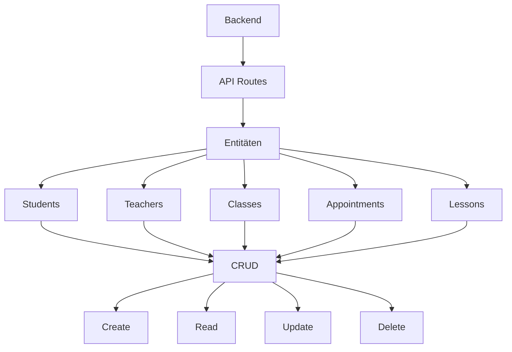
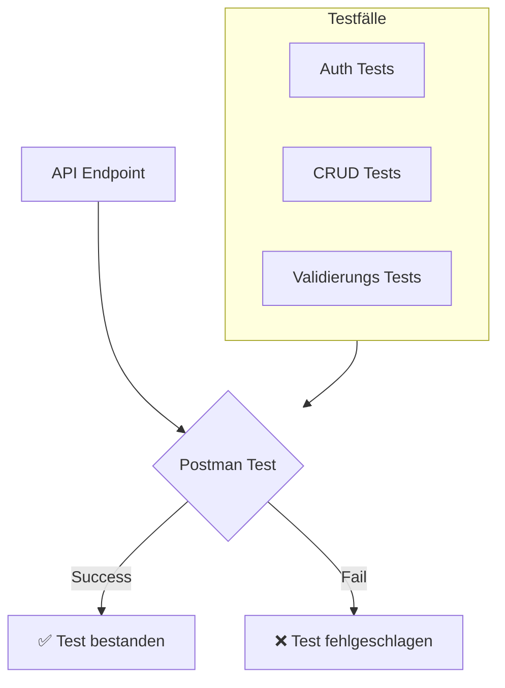

# KSH-Unterrichtsplanung
## Interdisziplinäre Projektarbeit

<!--Ben-->
---
transition: view-transition
layout: 'title-content'
hideInToc: true
---

<template v-slot:title>


# Inhaltsverzeichnis
</template>

<template v-slot:content>

<v-clicks animated="true">

- Aufgabenstellung
- Planungsinstrumente und Zeitplanung
- Aufbau und Konzeption der Applikation
- Technologieauswahl
- Umsetzung
- Testing
- Demo der Applikation
- Abschied
</v-clicks>
</template>

<!-- Shahin; Die Präsentation wird wie folgt ablaufen: Zunächst werde wir Ihnen die Aufgabenstellung wieder vorstellen, 
Danach gehen wir auf die Planungsinstrumente und die Zeitplanung ein. Im Anschluss erklären wir den Aufbau und die Konzeption der Applikation 
sowie die Auswahl der Technologien. Es folgt eine Vorstellung der Umsetzung, 
bevor wir in die Testphase einsteigen. Abschließend werden wir Ihnen eine Demo zeigen und 
dann die Präsentation mit einem kurzen Abschied beenden.-->
---
transition: view-transition
layout: two-content
---

<template v-slot:title>

# Aufgabenstellung
</template>

<template v-slot:left>

## Lehrkräfte
<v-clicks animated="true">

- Kalender
- Lektionen / Termine erfassen und bearbeiten
- Dateien hochladen
- Hausaufgaben eintragen
- Prüfungen erfassen
- Notizen (privat und öffentlich)
- Importieren von administrativen Terminen

</v-clicks>

</template>

<template v-slot:right>

## Schüler
<v-clicks>

- Kalender
- Hausaufgaben anzeigen lassen
- Dateien herunterladen
- Link pro Lektion öffnen

</v-clicks>

</template>

<!-- Lambo -->

---
tranisition: view-transition
layout: cover
---

# Planungsinstrumente und Zeitplanung


---
transition: view-transition
layout: two-content
---

<template v-slot:title>

# Planungsinstrumente
</template>


<template v-slot:left>

<v-click>

  ## Projektmanagements-Methode
  - **IPERKA**
    - 🤝 **Vertrautheit**
    - 🗃️ **Strukturiert**

</v-click>
</template>

<template v-slot:right>

<v-click>

  ## Kollaborationssoftware
  - **Notion**
    - **Funktionen**
      - Kalender 📅
      - Erinnerungen ⏰
      - Anpassbare Vorlagen
    - 📤📥 **Teamarbeit**
    - 📅 **Planung & Terminierung**
    - 👀 **Transparenz**
  
</v-click>
</template>


<!-- Lambo -->
<!--Für die Kollaborationssoftware haben wir das Tool Notion verwendet. Grund dafür waren u.A. die vielen Funktionalitäten die es anbietet, so z.B. das automatische Erstellen von Gantt-Diagrammen, perfekt für unser IPERKA. Zudem -->
<!-- Perfekt für parallele Aufgaben, bei denen alle Teammitglieder gleichzeitig informiert sind -->
<!--  Zuteilung von Aufgaben und Festlegung von Terminen mit Abhängigkeiten-->
<!--Eignet sich für eine strukturierte Arbeitsweise. Iperka hat uns gezwungen schon von Grund auf eine gut durchdachte Planung zu entwerfen, was bei einer PM-Methode wie SCRUM nicht der Fall gewesen wäre-->
---
transition: view-transition
layout: two-content
---

<template v-slot:title>

# Zeitplanung
</template>

<template v-slot:left>


</template>

<template v-slot:right>

<v-click>


</v-click>
</template>

<!-- Lambo
Ausserdem gab es eine gewisse Transparenz, sowohl für uns, aber auch für sie als betreuer, da Ist- und Soll-Zustand jederzeit einsehbar, Planung immer abrufbar .-->

---
transition: view-transition
layout: cover
---

# Aufbau und Konzeption der Applikation


---
layout: dashboard
---

<template v-slot:title>

# Aufbau der Applikation
</template>

<div class="flex gap-16 items-center justify-center mt-20">
  <div v-click class="flex flex-col items-center">
    <div class="text-6xl mb-4 bg-blue-100 p-8 rounded-xl shadow-md">
      <mdi-monitor-screenshot />
    </div>
    <div class="text-xl opacity-80 font-semibold">View</div>
    <div class="text-sm opacity-50">Benutzeroberfläche</div>
  </div>
  <div v-click class="flex flex-col gap-8">
    <div class="text-3xl text-gray-400">
      <carbon-arrow-right />
    </div>
    <div class="text-3xl text-gray-400">
      <carbon-arrow-left />
    </div>
  </div>
  <div v-click class="flex flex-col items-center">
    <div class="text-6xl mb-4 bg-green-100 p-8 rounded-xl shadow-md">
      <mdi-xml />
    </div>
    <div class="text-xl opacity-80 font-semibold">Controller</div>
    <div class="text-sm opacity-50">Steuerungslogik</div>
  </div>
  <div v-click class="flex flex-col gap-8">
    <div class="text-3xl text-gray-400">
      <carbon-arrow-right />
    </div>
    <div class="text-3xl text-gray-400">
      <carbon-arrow-left />
    </div>
  </div>
  <div v-click class="flex flex-col items-center">
    <div class="text-6xl mb-4 bg-red-100 p-8 rounded-xl shadow-md">
      <mdi-database />
    </div>
    <div class="text-xl opacity-80 font-semibold">Model</div>
    <div class="text-sm opacity-50">Datenspeicher</div>
  </div>
</div>

<!-- Lambo -->

---
layout: two-content
background: 
image: /public/low-fidelity.png
---

<template v-slot:title>

# Konzeption
</template>

<template v-slot:left>
<div class="grid grid-cols-1 grid-rows-1">
  <div class="col-start-1 row-start-1" v-click.hide="1">
    
  </div>
  <div class="col-start-1 row-start-1" v-click="1">
    
  </div>
</div>
</template>

<template v-slot:right>
<div class="grid grid-cols-1 grid-rows-1">
  <div class="col-start-1 row-start-1" v-click.hide="1">
    <h2>Designansatz</h2>
    <ul class="mt-4">
      <li>🎨 Zuerst Designs erstellt für grobe UI-Vorstellung</li>
      <li>📱 Low-Fidelity Keyscreens</li>
      <li>✏️ Mehrere Skizzen pro Keyscreen</li>
      <li>🏆 Auswahl der Favoriten</li>
    </ul>
  </div>

  <div class="col-start-1 row-start-1" v-click="1">
    <h2>Mid-Fidelity Wireflow</h2>
    <ul class="mt-4">
      <li>🔧 Tool: Moqups</li>
      <li>🔎 Detailiertere Keyscreens</li>
      <li>💬 Präsentation & Feedback</li>
    </ul>
  </div>
</div>
</template>

<!-- Moi; Wir haben uns entschieden, nicht direkt mit dem Frontend zu beginnen, sondern Design zu entwickeln. Erste Skizzen von Hand, um die Grundstruktur 
zu visualisieren. Da Wir uns nicht gross einschränken wollten, haben wir mehrere Varianten pro Keyscreen erstellt und dann unsere Favoriten ausgewählt.
Danach haben wir mit Moqups die Keyscreens überarbeitet und ein Wireflow erstellt, um eine Vorstellung des Userflows zu erhalten. DIeses haben wir dann Ihnen 
präsentiert & dadurch wertvolles Feedback erhalten
-->

---
transition: view-transition
layout: cover
---

# Technologieauswahl


---
layout: dashboard
---

<template v-slot:title>

# Backend
</template>

<table>
<tbody>
  <tr>
    <th>Sprache (Framework)</th>
    <th>Vorwissen</th>
    <th>Built-in Features</th>
  </tr>
  <tr>
    <td>Python (Flask)</td>
    <td>3</td>
    <td>4</td>
  </tr>
    <tr>
    <td>Python (Django)</td>
    <td>1</td>
    <td>5</td>
  </tr>
    <tr>
    <td>Javascript (Express)</td>
    <td>3</td>
    <td>4</td>
  </tr>
  <tr>
    <td>Go (Echo, Gin)</td>
    <td>1</td>
    <td>3</td>
  </tr>
  <tr>
    <td>Javascript (NextJS)</td>
    <td>5</td>
    <td>5</td>
  </tr>
</tbody>
</table>

<style>
  th {
    font-weight: bold;
  }
</style>

<!-- Lambo -->

---
layout: dashboard
---

<template v-slot:title>

# Frontend
</template>

<table>
<tbody>
<tr class="font-bold">
    <th>Sprache (Framework)</th>
    <th>Vorwissen</th>
    <th>Built-in Features</th>
  </tr>
  <tr>
    <td>Javascript</td>
    <td>5</td>
    <td>1</td>
  </tr>
    <tr>
    <td>React</td>
    <td>3</td>
    <td>2</td>
  </tr>
    <tr>
    <td>Astro</td>
    <td>1</td>
    <td>4</td>
  </tr>
  <tr>
    <td>Angular</td>
    <td>1</td>
    <td>2</td>
  </tr>
  <tr>
    <td>NextJS</td>
    <td>4</td>
    <td>4</td>
  </tr>
</tbody>
</table>

<style>
th {
  font-weight: bold
}
</style>

<!-- Lambo -->

---
layout: two-content
---

<template v-slot:title>

# Warum NextJS als Framework
</template>

<template v-slot:left>

- 🎯 **Einheitliche Technologie**
  - JavaScript für Frontend & Backend
  - Weniger Technologie-Wechsel
<v-clicks animated="true">

- 🚀 **Serverless Ready**
  - API-Routen integriert
  - Einfaches Deployment
- 👥 **Team-Erfahrung**
  - Vorhandenes JS Know-how
  - Schnelle Implementierung

</v-clicks>
</template>

<template v-slot:right>


</template>

<!-- Lambo -->

---
layout: two-content
---

<template v-slot:title>

# Datenbank
</template>

<template v-slot:left>
<div v-click class="flex text-[200px] w-full h-[85%] flex-col">
  <div v-click.hide="3">
    <h1>Planetscale</h1>
    <logos-planetscale />
  </div>
</div>
</template>

<template v-slot:right>
<div v-click="2" class="flex text-[200px] w-full h-[85%] flex-col">
  <h1>MongoDB</h1>
  <logos-mongodb-icon />
</div>
</template>

<!-- Lambo -->

---
layout: two-content
---

<template v-slot:title>

# Benutze Libraries
</template>

<template v-slot:left>

## Frontend

<v-clicks>

- 🌐**Axios**: HTTP-Client für einfache API-Anfragen.  
  - Unterstützt Promises
  - Automatisches Parsen von JSON-Daten
  - Fehlerbehandlung bei API-Requests
- 📅**FullCalendar**: Interaktiver Kalender mit umfangreichen Funktionen.  
  - Anzeige von Events und Zeitplänen
  - Anpassbar für verschiedene Layouts und Designs
- 🎨**Styling**
  - TailwindCSS
  - shadcn/ui
  - heroicons
</v-clicks>
</template>

<template v-slot:right>

## Backend
<v-clicks>

- 🔒**bcrypt**: Verschlüsselungsbibliothek zur sicheren Speicherung von Passwörtern (Hashing & Salting).
- 🛠️**Prisma**: ORM (Object-Relational Mapper) für den Zugriff auf die Datenbank.  
  - Einfaches Erstellen von komplexen Abfragen
- 🔑**jsonwebtoken (JWT)**: Token-basierte Authentifizierung und Autorisierung.  
  - Sichere Übertragung von Benutzerinformationen
  - Verifizierung durch Signatur
</v-clicks>
</template>

<!-- Ben -->

---
layout: cover
---

# Umsetzung


---
layout: title-content
---

<template v-slot:title>

# Tech Stack Ablauf
</template>

<template v-slot:content>

<div class="flex gap-12 items-center justify-center mt-28">
  <div v-click="1" class="flex flex-col items-center">
    <div class="text-6xl mb-4">
      <logos-nextjs-icon />
    </div>
    <div class="text-sm opacity-50">Next.js Frontend</div>
  </div>
  <div v-click="1" class="text-3xl text-gray-400">
    <carbon-arrow-right />
  </div>
  <div v-click="2" class="flex flex-col items-center">
    <div class="text-6xl mb-4">
      <logos-nextjs-icon />
    </div>
    <div class="text-sm opacity-50">Next.js Backend</div>
  </div>
  <div v-click="2" class="text-3xl text-gray-400">
    <carbon-arrow-right />
  </div>
  <div v-click="3" class="flex flex-col items-center">
    <div class="text-6xl mb-4">
      <logos-prisma />
    </div>
    <div class="text-sm opacity-50">Prisma</div>
  </div>
  <div v-click="3" class="text-3xl text-gray-400">
    <carbon-arrow-right />
  </div>
  <div v-click="4" class="flex flex-col items-center">
    <div class="text-6xl mb-4">
      <logos-mongodb-icon />
    </div>
    <div class="text-sm opacity-50">MongoDB</div>
  </div>
</div>
</template>

<!-- Ben -->

---
layout: two-content
---

<template v-slot:title>

# Backend Architektur
</template>

<template v-slot:left>



</template>

<template v-slot:right>

## Struktur
<v-clicks animated="true">

- 📁 **API-Routes**
  - RESTful Endpunkte
  - Modular aufgebaut
- 🔄 **CRUD Operationen**
  - Standardisierte Methoden
  - Entity-basierte Struktur
- 🛠️ **Prisma als ORM**
  - Type-safe Queries
  - MongoDB Integration

</v-clicks>

</template>

<!-- Ben -->

---
layout: dashboard
---

<template v-slot:title>

# API Endpunkt
</template>


```ts {all|9|11-15|17-27|29-39|41|42-52|all}{lines:true}
// pages/api/appointment/create.js
import { PrismaClient } from "@prisma/client";

const prisma = new PrismaClient();

export default async function handler(req, res) {
    if (req.method === "POST") {
        try {
            const { teacherId, title, start_time, end_time, notes, location, imported } = req.body;

            if (!teacherId || !title || !start_time || !end_time || imported === undefined ) {
                return res
                    .status(400)
                    .json({ message: "Alle Felder müssen ausgefüllt sein." });
            }

            const existing_teacher = await prisma.teacher.findUnique({
                where: {
                    id: teacherId,
                },
            });

            if (!existing_teacher) {
                return res
                    .status(404)
                    .json({ message: "Lehrer nicht gefunden." });
            }

            const newAppointment = await prisma.appointment.create({
                data: {
                    teacherId,
                    title,
                    start_time,
                    end_time,
                    notes,
                    location,
                    imported
                },
            });

            return res.status(201).json(newAppointment);
        } catch (error) {
            return res
                .status(500)
                .json({ message: "Fehler beim Erstellen des Termins" });
        }
    } else {
        res.setHeader("Allow", ["POST"]);
        res.status(405).end(`Method ${req.method} not allowed`);
    }
}
```

<!-- Ben -->

---
layout: two-content
---

<template v-slot:title>

# Authentifizierung
</template>


<template v-slot:left>
<v-click>

# Lehrer
- 🔐 Passwort erforderlich
- 👥 Voller Zugriff
- 🔒 Bcrypt Verschlüsselung
- ⏰ 7-Tage Session
</v-click>
</template>

<template v-slot:right>
<v-click>

# Schüler
- 👤 Nur Benutzername & Klassenauswahl
- 🔒 Eingeschränkter Zugriff
- ⚡ Vereinfachte Anmeldung
- ⏰ 7-Tage Session
</v-click>
</template>

<!-- Ben -->

---
layout: two-content
---

<template v-slot:title>

# Implementierung des Kalenders
</template>

<template v-slot:left>


</template>

<template v-slot:right>

## FullCalendar
  - Gründe
    - Gratis
    - Funktionalitäten
    - Gute Dokumentation
    - MIT-Lizenz
  - Fokus auf Datahandling
  <!-- Hauptsächlich Arbeit an der Datenverarbeitung und -darstellung. -->
  
</template>

<!-- Shahin; Unser Herzstück ist der Kalender, welcher mithilfe der Bibliothek FullCalendar erstellt wurde. FullCalendar hat diverse Vorteile,
da wäre zum einen der Preis von 0.- Franken, die vielen Funktionalitäten / OPtionen, die outofthebox dabei waren und 
anpassbar waren, z.B. verschiedene Anischten, Farben für Events / Tage. Zudem bot die Bibliothek eine sehr gute Doku und war mit MIT
lizenziert worde, was es uns ermöglichte, die Bibliothek ohne grosse Probleme für uns zu verwenden.
-->

---
layout: two-content
---

<template v-slot:title>

# User Interface
</template>

<template v-slot:left>

<v-click>

  ## Design
  - 🌐 Inspiration von KSH-Website
  - 🎨 Blasser Hintergrund
  - ❄️ Kalte Farben
  
</v-click>

</template>

<template v-slot:right>

<v-click>

  ## UX
  - Gruppierung der Felder
  - 📏 Abstand zwischen Feldern
  - Verwendung von bekannten Icons

</v-click>
</template>


<!-- Shahin; Beim Design haben wir uns sehr stark an die Farbliche GEstaltung der KSH-Website orientiert, um genauer zu sein haben wir einen sehr 
blassen blauen Hintergrund verwendet. Das hatte auch zusätzlich den Vorteil, dass der eigentliche Inhalt besser hervorgehoben wird. Allg. eher kältere Farben, 
(Blau , Violett, Weiss),  damit das Design nicht mit dem Hintergrundbild zusammenprallt. Felder für allgemeine Infos zusammengefasst, 
um für bessere Usability Eingabeprozess zu optimieren. 
Auch fürs UX haben wir uns einige Gedanken gemacht; Felder miteinander gruppiert; Unterschiedliche Abstände zwischen den Eingabefeldern sorgen für visuelle Klarheit, 
bessere Wahrnehmung & bewusst / unbewusste Gruppierung der Felder. Für Aktionen haben wir auch Icons verwendet, welche eigentlich jedem bekannt sein sollte, so z.B. 
eine Mülltonne fürs löschen oder ein Stift fürs bearbeiten.
-->

---
layout: cover
image: 
---

# Testing


---
layout: two-content
---

<template v-slot:title>

# Backend Testing
</template>

<template v-slot:left>



</template>

<template v-slot:right>

## Automatisierte API Tests
<v-clicks animated="true">

- 🛠️ **Postman als Testtool**
  - Automatisierte Ausführung
  - API Endpunkt Tests
  - Request/Response Validierung
- 📋 **Testumfang**
  - Authentifizierung
  - CRUD Operationen
  - Eingabevalidierung
  - Fehlerfälle
- ✅ **Resultate**
  - Alle Tests erfolgreich
  - Dokumentierte Testfälle
  - Wiederholbare Tests

</v-clicks>

</template>

<!-- Ben -->

---
layout: two-content
---

<template v-slot:title>

# Frontend Testing
</template>

<template v-slot:left>

## UX-Tests

<v-clicks>

  - **🧠 Cognitive Walkthrough als Testmethode**
    - Durchführung mit Experten
    - Realistische Nutzungsszenarien
  - **📋 Testumfang**
    - Lehrer
      - Lektion eintragen
      - Exceldatei einlesen
      - Lektion bearbeiten
    - Schüler
      - Hausaufgabe anzeigen
      - Lektionen-Link kopieren
  - **✅ Resultate**
    - Schüleransicht: wenig Verbesserungspotential
    - Excelimport: ein Experte hatte Schwierigkeiten

</v-clicks>
</template>

<template v-slot:right>

  <table>
    <tbody>
      <tr>
        <th>Seite</th>
        <th>Benötigte Zeit (in s)</th>
        <th>Bemerkungen</th>
      </tr>
      <tr>
        <td>Kalender</td>
        <td>24</td>
        <td>Ist direkt runtergescrollt und hat Button für Lektionformular nicht gesehen, mehrmals auf Tag des Startdatums gedrückt, war verwirrt warum Applikation nicht reagiert</td>
      </tr>
        <tr>
        <td>Lektionsformular</td>
        <td>97</td>
        <td> - </td>
      </tr>
    </tbody>
  </table>
</template>

<!-- Shahin; Beim Frontend haben wir hauptsächlich das UX getestet. Hierbei haben wir mit mehreren "Experten" das System getestet, wobei wir drauf geachtet haben,
dass ihre Aufagben ein realistisches NUtzungsszenario wiederspiegelt. Genauer gesagt mussten die Lehrer eine Lketion mit gegbenen
Informationen eintragen, diese später bearbeiten & das Excelfile einlesen. Der Schüler musste sich die HA anzeigen lassen & den Link
einer Lektion kopieren. Unsere Tests waren sehr erfreuend, da es insgesamt sehr wenig Verbesserungspotential gab.-->

---
transition: view-transition
layout: cover
background: ./low-fidelity.png
---

# Demo der Applikation


---
transition: view-transition
layout: center
---

# Herzlichen Dank für Ihre Aufmerksamkeit

<!-- Wir hoffen dass ihnen die Präsentation gefallen hat & dass sie an unserem Produkt gefallen finden -->