---
# You can also start simply with 'default'
theme: academic
colorSchema: light
themeConfig: 
  paginationY: 'b'
# random image from a curated Unsplash collection by Anthony
# like them? see https://unsplash.com/collections/94734566/slidev
background: https://cover.sli.dev
# some information about your slides (markdown enabled)
title: KSH-Unterrichtsplaner
author: Ben Brändle | Shahin Amon | Lambotharan Logendran
info: |
  ## Slidev Starter Template
  Presentation slides for developers.

  Learn more at [Sli.dev](https://sli.dev)
# apply unocss classes to the current slide
class: text-center
# https://sli.dev/features/drawing
drawings:
  persist: false
# slide transition: https://sli.dev/guide/animations.html#slide-transitions
transition: view-transition
# enable MDC Syntax: https://sli.dev/features/mdc
mdc: true
# take snapshot for each slide in the overview
overviewSnapshots: true
hideInToc: true
---

# KSH-Unterrichtsplanung
## Interdisziplinäre Projektarbeit

---
transition: view-transition
layout: 'title-content'
hideInToc: true
---
<template v-slot:title>

# Inhaltsverzeichnis
</template>

<template v-slot:content>
<v-clicks>

<toc />

</v-clicks>
</template>

---
transition: view-transition
layout: 'title-content'
---

<template v-slot:title>

# Aufgabenstellung

</template>

<template v-slot:content>

<v-clicks depth="2">

  - Kalender 
  - Lehrkräfte
    - Ansicht
    - Lektionen erfassen und bearbeiten 
    - Hausaufgaben
    - Prüfungen
    - Notizen
  - Sus
    - Kalendaransicht 
  - Importieren 

</v-clicks>
</template>


---
transition: view-transition
layout: 'two-content'
---

<template v-slot:title>

# Planungsinstrumente
</template>

<template v-slot:left>

  ## Projektmanagements-Methode
</template>

<template v-slot:right>

  ## Kollaborationssoftware / Groupware
  
</template>

---
transition: view-transition
layout: two-content
---

<template v-slot:title>

# Zeitplanung
</template>

---
layout: cover
background: '/cover-image.jpg'  # Du kannst hier dein eigenes Hintergrundbild verwenden
---

# Backend 

<div class="text-xl text-gray-200 mt-4">
Moderne API-Architektur mit Next.js
</div>

<style>
h1 {
  background-color: #2B90B6;
  background-image: linear-gradient(45deg, #4EC5D4 10%, #146b8c 20%);
  background-size: 100%;
  -webkit-background-clip: text;
  -moz-background-clip: text;
  -webkit-text-fill-color: transparent;
  -moz-text-fill-color: transparent;
}
</style>

---
layout: center
---

<template v-slot:default>

# Tech Stack

<div class="flex gap-12 items-center justify-center mt-8">
  <div v-click class="flex flex-col items-center">
    <div class="text-6xl mb-4">
      <logos-nextjs-icon />
    </div>
    <div class="text-sm opacity-50">Next.js</div>
  </div>
  <div v-click class="text-3xl text-gray-400">
    <carbon-arrow-right />
  </div>
  <div v-click class="flex flex-col items-center">
    <div class="text-6xl mb-4">
      <logos-prisma />
    </div>
    <div class="text-sm opacity-50">Prisma</div>
  </div>
  <div v-click class="text-3xl text-gray-400">
    <carbon-arrow-right />
  </div>
  <div v-click class="flex flex-col items-center">
    <div class="text-6xl mb-4">
      <logos-mongodb-icon />
    </div>
    <div class="text-sm opacity-50">MongoDB</div>
  </div>
</div>
</template>

---
layout: two-content
---

<template v-slot:title>

# Technologieauswahl
</template>

<template v-slot:left>


</template>

<template v-slot:right>

## Warum Next.js?
<v-clicks>

- 🎯 **Einheitliche Technologie**
  - JavaScript für Frontend & Backend
  - Weniger Technologie-Wechsel
- 🚀 **Serverless Ready**
  - API-Routen integriert
  - Einfaches Deployment
- 👥 **Team-Erfahrung**
  - Vorhandenes JS Know-how
  - Schnelle Implementierung

</v-clicks>

</template>

---
layout: two-content
---

<template v-slot:title>

# Backend Architektur
</template>

<template v-slot:left>


</template>

<template v-slot:right>

## Struktur
<v-clicks>

- 📁 **API-Routes**
  - RESTful Endpunkte
  - Modular aufgebaut
- 🔄 **CRUD Operationen**
  - Standardisierte Methoden
  - Entity-basierte Struktur
- 🛠️ **Prisma als ORM**
  - Type-safe Queries
  - MongoDB Integration

</v-clicks>

</template>

---
layout: code-side
---

<template v-slot:title>

# API Implementation
</template>

<template v-slot:code>

```ts {all|3-7|9-13|15-19|all}
// pages/api/class/create.ts
export default async function handler(req, res) {
  // Methoden-Validierung
  if (req.method !== 'POST') {
    return res.status(405).json({ 
      message: 'Methode nicht erlaubt' 
    });
  }
  
  // Daten-Validierung
  if (!req.body.name) {
    return res.status(400).json({
      error: 'Klassenname erforderlich'
    });
  }
  
  try {
    const newClass = await prisma.class.create({
      data: {
        name: req.body.name,
        createdAt: new Date(),
        // weitere Felder...
      }
    });
    
    return res.status(201).json(newClass);
  } catch (error) {
    return res.status(500).json({ 
      error: 'Klasse konnte nicht erstellt werden' 
    });
  }
}
```

</template>

<template v-slot:diagram>

## API-Struktur
<v-clicks>

- ✅ **Validierung**
  - Methoden-Check
  - Daten-Validierung
- 🔒 **Sicherheit**
  - Input Sanitization
  - Error Handling
- 📝 **Responses**
  - Status Codes
  - Error Messages

</v-clicks>

</template>

---
layout: diagram-side
---

<template v-slot:title>
# Authentifizierung

```mermaid {scale: 0.55}
sequenceDiagram
    participant B as Benutzer
    participant A as Auth API
    participant D as Datenbank
    
    B->>A: Login Anfrage
    A->>D: Prüfe Zugangsdaten
    D-->>A: Gültig ✓
    A->>A: Token generieren
    A-->>B: Token senden (7 Tage)
    Note over B,A: Token im localStorage
    B->>A: API Anfrage mit Token
    A->>A: Token validieren
    A-->>B: Geschützte Daten
```

</template>

<template v-slot:diagram>

</template>

<template v-slot:content>

<v-clicks>

# Lehrer
- 🔐 Passwort erforderlich
- 👥 Voller Zugriff
- ⏰ 7-Tage Session
- 🔒 Bcrypt Verschlüsselung

# Schüler
- 👤 Nur Benutzername
- 📚 Klassenauswahl
- 🔒 Eingeschränkter Zugriff
- ⚡ Vereinfachte Anmeldung

</v-clicks>

</template>

---
layout: two-content
---

<template v-slot:title>
# Backend Testing
</template>

<template v-slot:left>

## Postman Tests
<v-clicks>

- 🧪 **Automatisierte API Tests**
  - Vollständige API-Abdeckung
  - Wiederholbare Tests
- 📝 **Testfälle**
  - Authentifizierung
  - CRUD Operationen
  - Fehlerfälle
- 🔄 **Kontinuierliche Tests**
  - Vor jedem Release
  - Nach API-Änderungen

</v-clicks>

</template>

<template v-slot:right>

## Beispiel Test Collection
```json
{
  "info": {
    "name": "IDPA_backend"
  },
  "item": [
    {
      "name": "Auth Tests",
      "item": [
        "Teacher Login",
        "Student Login",
        "Invalid Login"
      ]
    },
    {
      "name": "Class Tests",
      "item": [
        "Create Class",
        "Get Class",
        "Update Class",
        "Delete Class"
      ]
    }
  ]
}
```

</template>


---
transition: view-transition
layout: section
---

<template v-slot:title>

# Demo
</template>

---
transition: view-transition
layout: section
---

<template v-slot:title>

# Fazit 
</template>
