# KSH-Unterrichtsplanung
## Interdisziplinäre Projektarbeit

---
transition: view-transition
layout: 'title-content'
hideInToc: true
---

<template v-slot:title>

# Inhaltsverzeichnis
</template>

<template v-slot:content>

- Einleitung
<v-clicks>

- Aufgabenstellung und Ausgangslage
- Vorgehen und Planungsinstrumente
- Konzeption der Applikation
- Technologieauswahl
- Umsetzung
- Testing
- Demo der Applikation
- Fazit und Ausblick
</v-clicks>
</template>

---
transition: view-transition
layout: 'title-content'
---

<template v-slot:title>

# Aufgabenstellung
</template>

<template v-slot:content>

<v-clicks animated="true">

- 📅 **Kalender**
- 👩‍🏫 **Lehrkräfte**
  - Ansicht
  - Lektionen erfassen und bearbeiten
  - Hausaufgaben
  - Prüfungen
  - Notizen
- 🧑‍🎓 **Sus**
  - Kalenderansicht
- 📥 **Importieren**

</v-clicks>
</template>


---
transition: view-transition
layout: 'two-content'
---

<template v-slot:title>

# Planungsinstrumente
</template>

<template v-slot:left>

  ## Projektmanagements-Methode
  <!--War schon in vorherigen Projekte unsere go-to PM-Methode, Alle Gruppenmitglieder sind mit der Methode vertraut. -->
  - 🤝 **Vertrautheit**
  <!--Eignet sich für eine strukturierte Arbeitsweise. Iperka hat uns gezwungen schon von Grund auf eine gut durchdachte Planung zu entwerfen, was bei einer PM-Methode wie SCRUM nicht der Fall gewesen wäre-->
  - 🗃️ **Strukturiert**
</template>

<template v-slot:right>

  ## Kollaborationssoftware / Groupware
  <!--Für die Kollaborationssoftware haben wir das Tool Notion verwendet. Grund dafür waren u.A. die vielen Funktionalitäten die es anbietet, so z.B. das automatische Erstellen von Gantt-Diagrammen, perfekt für unser IPERKA. Zudem -->
  - **Funktionen** Kalender 📅, Erinnerungen ⏰, anpassbare Vorlagen und einfache Oberfläche 🖥️.
  - 📤📥 **Teamarbeit** Perfekt für parallele Aufgaben, bei denen alle Teammitglieder gleichzeitig informiert sind .
  - 📅 **Planung & Terminierung** Zuteilung von Aufgaben und Festlegung von Terminen mit Abhängigkeiten 🔗.
  <!--Ausserdem gab es eine gewisse Transparenz, sowohl für uns, aber auch für sie als betreuer, da Ist- und Soll-Zustand jederzeit einsehbar, Planung immer abrufbar .-->
  - 👀 **Transparenz**

</template>

---
transition: view-transition
layout: two-content
---

<template v-slot:title>

# Zeitplanung
</template>

---
layout: dashboard
---

<template v-slot:title>

# Afbau der Applikation
</template>

<div class="flex gap-16 items-center justify-center mt-10">
  <div v-click class="flex flex-col items-center">
    <div class="text-6xl mb-4 bg-blue-100 p-8 rounded-xl shadow-md">
      <logos-html-5 />
    </div>
    <div class="text-xl opacity-80 font-semibold">View</div>
    <div class="text-sm opacity-50">Benutzeroberfläche</div>
  </div>
  <div v-click class="flex flex-col gap-8">
    <div class="text-3xl text-gray-400">
      <carbon-arrow-right />
    </div>
    <div class="text-3xl text-gray-400">
      <carbon-arrow-left />
    </div>
  </div>
  <div v-click class="flex flex-col items-center">
    <div class="text-6xl mb-4 bg-green-100 p-8 rounded-xl shadow-md">
      <logos-spring-icon />
    </div>
    <div class="text-xl opacity-80 font-semibold">Controller</div>
    <div class="text-sm opacity-50">Steuerungslogik</div>
  </div>
  <div v-click class="flex flex-col gap-8">
    <div class="text-3xl text-gray-400">
      <carbon-arrow-right />
    </div>
    <div class="text-3xl text-gray-400">
      <carbon-arrow-left />
    </div>
  </div>
  <div v-click class="flex flex-col items-center">
    <div class="text-6xl mb-4 bg-red-100 p-8 rounded-xl shadow-md">
      <logos-mysql />
    </div>
    <div class="text-xl opacity-80 font-semibold">Model</div>
    <div class="text-sm opacity-50">Geschäftslogik & Daten</div>
  </div>
</div>

---
layout: center
background: '/cover-image.jpg'  # Du kannst hier dein eigenes Hintergrundbild verwenden
---

# Backend 

<div class="text-xl text-gray-200 mt-4">
Moderne API-Architektur mit Next.js
</div>

<style>
h1 {
  background-color: #2B90B6;
  background-image: linear-gradient(45deg, #4EC5D4 10%, #146b8c 20%);
  background-size: 100%;
  -webkit-background-clip: text;
  -moz-background-clip: text;
  -webkit-text-fill-color: transparent;
  -moz-text-fill-color: transparent;
}
</style>

---
layout: title-content
---

<template v-slot:title>

# Tech Stack
</template>

<template v-slot:content>

<div class="flex gap-12 items-center justify-center mt-28">
  <div v-click class="flex flex-col items-center">
    <div class="text-6xl mb-4">
      <logos-nextjs-icon />
    </div>
    <div class="text-sm opacity-50">Next.js</div>
  </div>
  <div v-click class="text-3xl text-gray-400">
    <carbon-arrow-right />
  </div>
  <div v-click class="flex flex-col items-center">
    <div class="text-6xl mb-4">
      <logos-prisma />
    </div>
    <div class="text-sm opacity-50">Prisma</div>
  </div>
  <div v-click class="text-3xl text-gray-400">
    <carbon-arrow-right />
  </div>
  <div v-click class="flex flex-col items-center">
    <div class="text-6xl mb-4">
      <logos-mongodb-icon />
    </div>
    <div class="text-sm opacity-50">MongoDB</div>
  </div>
</div>
</template>

---
layout: two-content
---

<template v-slot:title>
# Technologieauswahl

```mermaid {scale: 0.7}
%%{init: {'theme': 'base', 'themeVariables': { 'fontSize': '16px'}}}%%
classDiagram
    class Technologievergleich {
        Next.js
        Flask
        Express
        Django
    }
    class Next.js {
        + Full-Stack Fähig
        + API Routes
        + JavaScript/TypeScript
        + Serverless Support
        - Steile Lernkurve
    }
    class Flask {
        + Leichtgewichtig
        + Einfach zu lernen
        + Flexible Struktur
        - Keine Frontend Tools
        - Zusätzliche Setup
    }
    class Express {
        + Große Community
        + Node.js Basis
        + Flexible Struktur
        - Frontend separat
        - Mehr Boilerplate
    }
    class Django {
        + All-in-One Lösung
        + Admin Interface
        + Viele Features
        - Komplex
        - Python-basiert
    }
```

</template>

<template v-slot:left>



</template>

<template v-slot:right>

## Warum Next.js?
<v-clicks>

- 🎯 **Einheitliche Technologie**
  - JavaScript für Frontend & Backend
  - Weniger Technologie-Wechsel
- 🚀 **Serverless Ready**
  - API-Routen integriert
  - Einfaches Deployment
- 👥 **Team-Erfahrung**
  - Vorhandenes JS Know-how
  - Schnelle Implementierung

</v-clicks>

</template>

---
layout: two-content
---

<template v-slot:title>

# Backend Architektur
</template>

<template v-slot:left>


</template>

<template v-slot:right>

## Struktur
<v-clicks>

- 📁 **API-Routes**
  - RESTful Endpunkte
  - Modular aufgebaut
- 🔄 **CRUD Operationen**
  - Standardisierte Methoden
  - Entity-basierte Struktur
- 🛠️ **Prisma als ORM**
  - Type-safe Queries
  - MongoDB Integration

</v-clicks>

</template>

---
layout: code-side
---

<template v-slot:title>

# API Implementation
</template>

<template v-slot:code>

```ts {all|3-7|9-13|15-19|all}
// pages/api/class/create.ts
export default async function handler(req, res) {
  // Methoden-Validierung
  if (req.method !== 'POST') {
    return res.status(405).json({ 
      message: 'Methode nicht erlaubt' 
    });
  }
  
  // Daten-Validierung
  if (!req.body.name) {
    return res.status(400).json({
      error: 'Klassenname erforderlich'
    });
  }
  
  try {
    const newClass = await prisma.class.create({
      data: {
        name: req.body.name,
        createdAt: new Date(),
        // weitere Felder...
      }
    });
    
    return res.status(201).json(newClass);
  } catch (error) {
    return res.status(500).json({ 
      error: 'Klasse konnte nicht erstellt werden' 
    });
  }
}
```

</template>

<template v-slot:diagram>

## API-Struktur
<v-clicks>

- ✅ **Validierung**
  - Methoden-Check
  - Daten-Validierung
- 🔒 **Sicherheit**
  - Input Sanitization
  - Error Handling
- 📝 **Responses**
  - Status Codes
  - Error Messages

</v-clicks>

</template>

---
layout: two-content
---

<template v-slot:title>

# Authentifizierung
</template>


<template v-slot:left>
<v-click>

# Lehrer
- 🔐 Passwort erforderlich
- 👥 Voller Zugriff
- ⏰ 7-Tage Session
- 🔒 Bcrypt Verschlüsselung
</v-click>
</template>

<template v-slot:right>
<v-click>

# Schüler
- 👤 Nur Benutzername
- 📚 Klassenauswahl
- 🔒 Eingeschränkter Zugriff
- ⚡ Vereinfachte Anmeldung
</v-click>
</template>


---
layout: two-content
---

<template v-slot:title>

# Backend Testing
</template>

<template v-slot:left>

## Postman Tests
<v-clicks>

- 🧪 **Automatisierte API Tests**
  - Vollständige API-Abdeckung
  - Wiederholbare Tests
- 📝 **Testfälle**
  - Authentifizierung
  - CRUD Operationen
  - Fehlerfälle
- 🔄 **Kontinuierliche Tests**
  - Vor jedem Release
  - Nach API-Änderungen

</v-clicks>

</template>

<template v-slot:right>

## Beispiel Test Collection
```json
{
  "info": {
    "name": "IDPA_backend"
  },
  "item": [
    {
      "name": "Auth Tests",
      "item": [
        "Teacher Login",
        "Student Login",
        "Invalid Login"
      ]
    },
    {
      "name": "Class Tests",
      "item": [
        "Create Class",
        "Get Class",
        "Update Class",
        "Delete Class"
      ]
    }
  ]
}
```

</template>


---
transition: view-transition
layout: section
---
<template v-slot>

# Frontend
</template>
---
transition: view-transition
layout: section
---

<template v-slot:title>

# Demo
</template>

---
transition: view-transition
layout: center
---


<template v-slot:title>

# Fazit 
</template>
